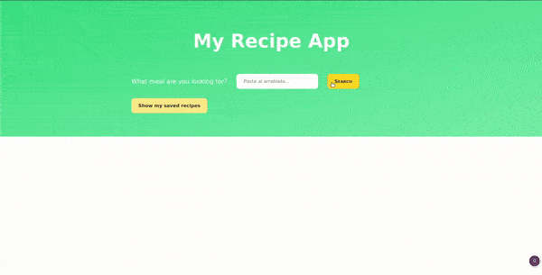

# CODED WITH

- Node.js
- Vanilla JS
- SQLite
- CSS
- HTML

# FUNCTIONS

- Query recipes from the MealDB API
- Add a recipe to our DB
- Show all our saved recipes
- Update saved recipes
- Delete saved recipes

# TO DO

- **CSS**
  - Mobile first...

- **Feedback** when adding a recipe to the DB (after clicking on the button)

- **Be able to update ingredients**

- **Refactor JS**

- **Allow searchs in recipes from the DB**

- **Create a whole recipe from scratch**
	- Ingredients:
		- One input / ingredient & a button "+" to generate a new line
	- Same for the category ===> needs a table `categories_per_recipe` & a table `categories`

- **API call from the backend**
  - To hide the API key

- **Add the thumbnail from your computer**
  - when in update or create mode

- **Escape modal** by clicking on the blacked out area

- **Trap the focus** within the modal

- **Allow other searches**
  - By category
  - By cuisine
  - By ingredient(s) 
    - possibly a list separated by commas? or same system as to create: one input / ingredient & possibility to add one

- **Updating the DB**
  - Create a table `categories_per_recipe` & a table `categories`

- **Insert tags** in the category input when updating/creating